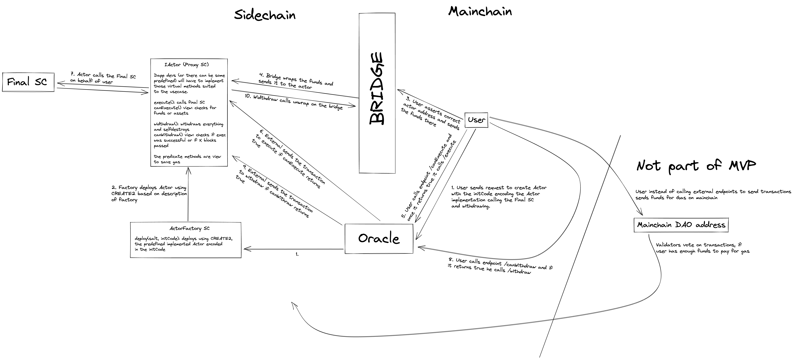

# Milkomeda Wrapped Smart Contracts

[Shortcut Epic](https://app.shortcut.com/dcspark/epic/7930)

[Proposal](https://docs.google.com/document/d/1tbhMmctw6RQKW_UUox0qOnqhOfBe7uHRO0sMx7Isaac)

## Setup

You need to have installed `node` and `npm`.

To install dependencies run:

```
npm install
```

## Tests

To run unit tests:

```
npm test
```

## Project Description

The project aims to create a seamless way to call smart contracts on the milkomeda sidechains right from the designated mainchain. The current way to use Milkomeda is to:

1. Download metamask
2. Add custom sidechain to the metamask
3. Wrap the assets
4. Interact with the dapp through the metamask
5. Unwrap the assets

Steps 1,2,4 might be confusing for the end-users, as metamask is not the wallet users are using on the mainchain. Step 2 might be confusing even for the users familiar with the Ethereum, as they are usually not required to add custom sidechains.

## Smart Contracts

The role of the Metamask wallet on the sidechain is for the user to have dedicated account. To get around this, the smart contract `Actor` will be acting on behalf of the user on the sidechain.

### Actor

Actor is designed to execute 2 functions `execute` and `withdraw`. `execute` is used to interact with the destination smart contract and `withdraw` to unwrap the assets through the bridge back to mainchain.

Since we can't deterministically say that the `execute` transaction will succeed, there is also a third function called `emergencyWithdraw`, which should unwrap the wrapped assets in case of some unexpected events. Emergency withdrawal is possible only after _n_ blocks since the deployment.

The actor shouldn't have any owner, therefore we need to also implement measures against the front running. Without them the attacker could front run the `execute` transaction before wrapping of the assets and waste the gas. For this purpose we have also `view` functions `canExecute` and `canWithdraw` which should check the balances of the required assets.

All of the above mentioned functions have virtual methods `executeCallback`, `withdrawCallback`, `emergencyWithdrawCallback`, `executePredicate` and `withdrawPredicate` which can be overridden by the child contracts.

Actor constructor takes 2 argumets: `payload` and `emergencyWithdrawalTimeout`. `payload` is the data that will be available to the all of the implemented functions. `emergencyWithdrawalTimeout` is the number of blocks after which the `emergencyWithdraw` function will be callable.

### Deployment

The standard deployment method of the Actors could be a attack vector. The user would have to trust the deployer, that the Actor is what he wanted to be and that the address is correct. To avoid this, we are using the `CREATE2` opcode, which allows us to deterministically create the address of the contract. The address is calculated from the salt, the deployer address and the initcode of the contract. The dapp is then able to assert the correct address returned from the deployer.

Since the `CREATE2` is an opcode, we need the `ActorFactory` smart contract to deploy the Actors. `ActorFactory` has 1 function `deploy` that takes two arguments `salt` and `initCode`. `initCode` is a transaction data to create the smart contract. It consists of the `Actor` bytecode and the constructor arguments.

### Offchain Service

The offchain service is an API server intended to call the smart contracts functions. The user is able to communicate with the `Actor` or `ActorFactory` through the provided endpoints.

- POST `/deploy` - calls the factory and deploys the actor, expects 2 arguments `salt` and `initCode` in the body, consumes the gas

- GET `/canExecute/:actorAddress` - checks if the actor can execute the transaction, expects 1 argument `actorAddress` in the url, doesn't consume gas

- GET `/canWithdraw/:actorAddress` - checks if the actor can withdraw the transaction, expects 1 argument `actorAddress` in the url, doesn't consume gas

- GET `/canEmergencyWithdraw/:actorAddress` - checks if the actor can emergency withdraw the transaction, expects 1 argument `actorAddress` in the url, doesn't consume gas

- POST `/execute` - calls an execute transasction, consumes gas

- POST `/withdraw` - calls a withdraw transaction, consumes gas

- POST `/emergencyWithdraw` - calls an emergency withdraw transaction, consumes gas

### Swapping usecase explained

Possible usecase could be dex swapping on the milkomeda sidechain. The Actor would swap the asset _A_ for the asset _B_.

`executePredicate` would check that if the Actor has wanted amount of asset _A_ to swap and also that it has enough coins to pay for unwrapping fee.

`execute` would call the dex smart contract to swap wanted amount of _A_ for _B_.

`withdrawPredicate` would check that the execute was successful.

`withdraw` would call the bridge to unwrap the _B_ asset.

`emergencyWithdraw` would call the bridge to unwrap the _A_ asset.

### Architecture schema sketch


